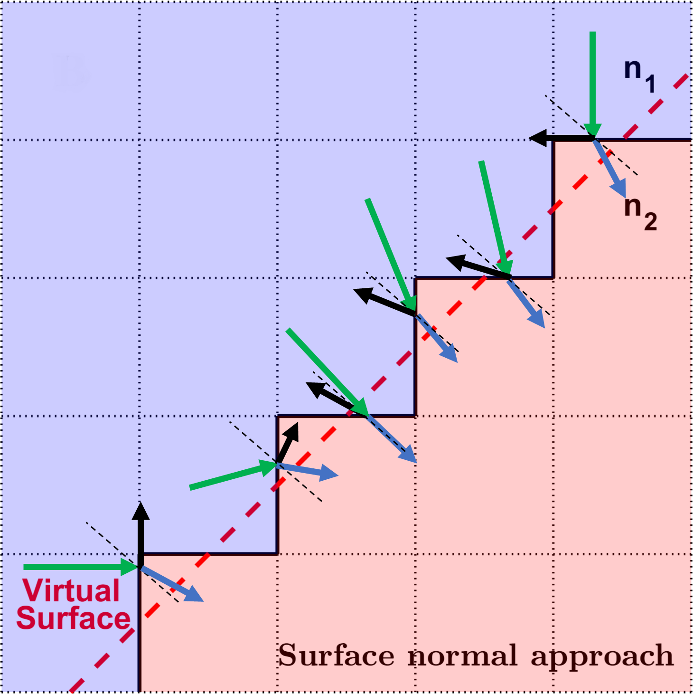
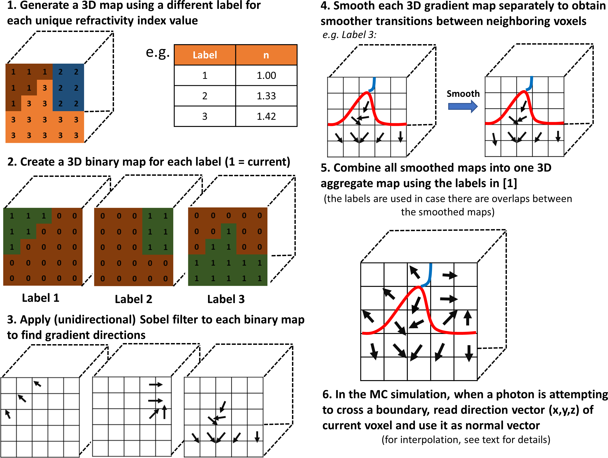

# mcxyzn 
## Overview
*mcxyzn* is an extension of *mcxyz.c* with accurate handling of curved, complex, and oblique surfaces when accounting for refraction and reflection event when light hits a boundary with mismatched indices of refraction. The details of this new methodology are to be found in:
> A.P. Tran and S.L. Jacques, 2020. Modeling voxel-based Monte Carlo light transport with curved and oblique boundary surfaces. Journal of Biomedical Optics, 25(2), p.025001.

While the information about mcxyz.c are to be found at:
> S. Jacques, T. Li, and S. Prahl, “mcxyz.c, a 3D Monte Carlo simulation of heterogeneous
tissues,” July 2019 version, http://omlc.org/software/mc/mcxyz/index.html .

Similarly to *mcxyz.c*, the extension mcxyzn is written in ANSI standard C, but adapted to handle two forms of parallelism:
* a multi-core CPU implementation using OpenMP that can be run across all platforms (MacOS, LinuxOS, and Windows)
* a GPU implementation that can be used with NVIDIA graphics cards

The 3D Monte Carlo generates an output file of relative fluence rate, F(y,x,z) [W/cm2 per W delivered] or [1/cm2]. The spatial distribution of absorption is obtained by the product of the fluence rate and the absorption coefficient: A(y,x,z) [1/cm3] = F(y,x,z) x muav(T(y,x,z), where muav(i) [cm-1] is the absorption coefficient of the ith tissue type (the v is for voxel).

## Compiling and availability of binaries

## Methodology
In this work, we introduce the "surface normal approach" that, instead of using the 6 facets of a cube to calculate the normal vector to a mismatched boundary, calculates a more accurate normal direction to the surface using the information of neighboring voxels. In the presence of mismatched boundaries, this represent an important difference between what has been traditionally done and the present work.

The essence of the proposed approach is to incorporate the *Sobel filter* (from image processing) to obtain an approximation to the normal vector that properly accounts for curvature effects and oblique angles as well as a 3D smoothing technique for vector fields (*smoothn*, for which citation information can be found at https://www.mathworks.com/matlabcentral/fileexchange/25634-smoothn). 

## Use

## Examples

